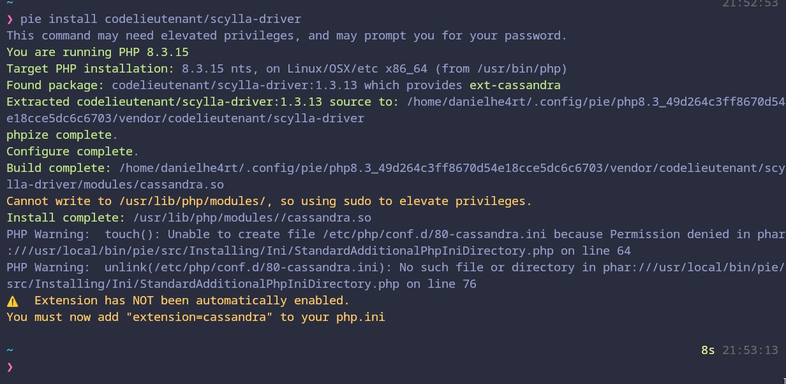

# Installing the Driver

Before creating your applications with ScyllaDB PHP Driver, make sure that your local machine has any PHP supported
version for the driver and [PIE (PHP Installer Extension)](https://github.com/php/pie), since we can install the driver
directly from there.

So, make sure you have the following prerequisites installed:

- Compilers: GCC 13.0+, Clang 16+ and c++23
- PHP: 8.1+
- Libraries:
    - [libUV](https://www.php.net/downloads)
    - [libscylladb](https://www.php.net/downloads)

## Installing the Prerequisites

### Installing LibUV

To install libUV, you can use the following commands based on your Linux Distro:

```bash
# Debian/Ubuntu
sudo apt install libuv1-dev

# Archlinux
sudo pacman -S libuv

# Fedora
sudo dnf install libuv-devel

# CentOS/RHEL
sudo dnf install epel-release
sudo dnf install libuv-devel
```

or if you prefer, you can build directly from source:

```bash
git clone --depth 1 -b v1.46.0 https://github.com/libuv/libuv.git \
    && cd libuv \
    && mkdir build \
    && cd build \
    && cmake -DBUILD_TESTING=OFF -DBUILD_BENCHMARKS=OFF -DLIBUV_BUILD_SHARED=ON CMAKE_C_FLAGS="-fPIC" -DCMAKE_BUILD_TYPE="RelWithInfo" -G Ninja .. \
    && ninja install
```

### Installing LibScyllaDB

To install libScyllaDB you will need to get directly from the GitHub Repository since we need the latest version:

```bash
git clone --depth 1 https://github.com/scylladb/cpp-driver.git scyladb-driver \
  && cd scyladb-driver \
  && mkdir build \
  && cd build \
  && cmake -DCASS_CPP_STANDARD=17 -DCASS_BUILD_STATIC=ON -DCASS_BUILD_SHARED=ON -DCASS_USE_STD_ATOMIC=ON -DCASS_USE_TIMERFD=ON -DCASS_USE_LIBSSH2=ON -DCASS_USE_ZLIB=ON CMAKE_C_FLAGS="-fPIC" -DCMAKE_CXX_FLAGS="-fPIC -Wno-error=redundant-move" -DCMAKE_BUILD_TYPE="RelWithInfo" -G Ninja .. \
  && ninja install
```

After that, move the binary to your system path and we're ready to install the driver!

## Installing the Driver

To install the driver, you should use [PIE](https://github.com/php/pie) to install it directly from the PHP repository:

```bash
pie install codelieutenant/scylla-driver
```

With that, you probably can check at your PHP Info if the driver is installed correctly.

:::warning

If you're not running as a sudoer, you will have to manually enable the extension in your `php.ini` file manually.



